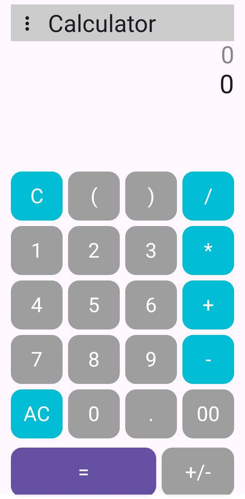
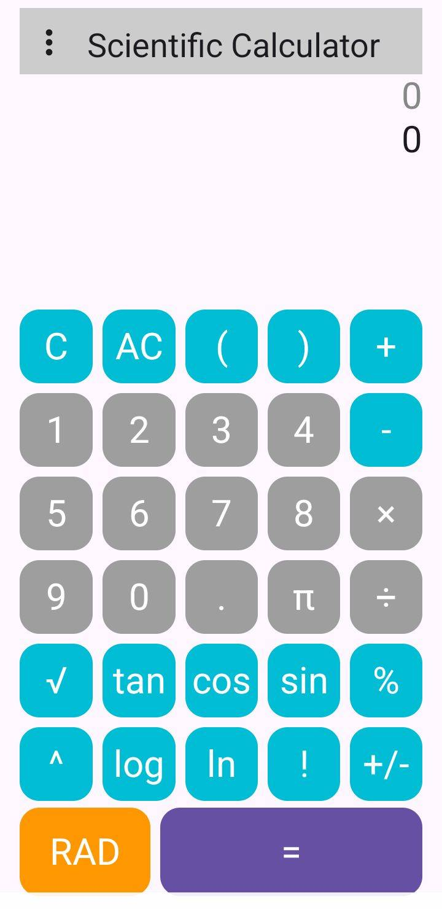

# 🧮 Ultimate Calculator

A modern multi-mode calculator app built with **Kotlin** and **Jetpack Compose**
with three modes :Normal Calculator, Scientific Mode, Area Converter.

---

## 🚀 Features

- 🔢 Normal Calculator (basic operations)
- 🧪 Scientific Mode (trig, log, power, etc.)
- 📐 Area Converter (Pi)
- ✨ Clean UI using Jetpack Compose

---

## 📸 Screenshots

| Normal                       | Scientific                           | Area                     |
|------------------------------|--------------------------------------|--------------------------|
|  |  |  |

---

## 📦 Getting Started

1. Clone the repo:

```bash
git clone https://github.com/RiyasDev72/Ultimate_Calculator.git
```

2. Open in Android Studio
3. Run the app on an emulator or device

---

## 🛠 Tech

- **Kotlin**
- **Jetpack Compose**

---

## 📄 License

MIT License – see [LICENSE.md](LICENSE.md)

---

## 👨‍💻 Author

**RiyasDev72**

